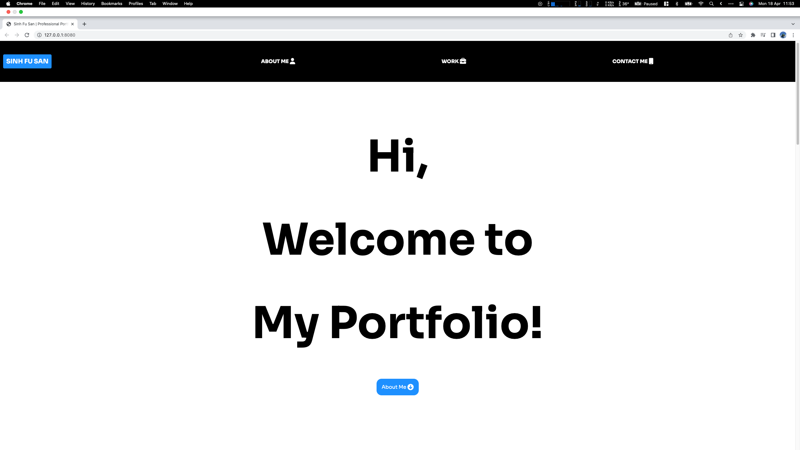
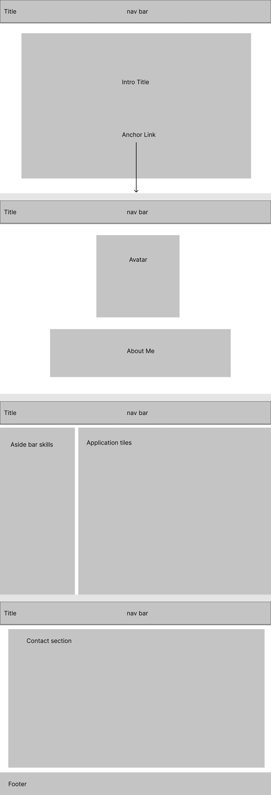

# Professional-Portfolio

## Overview

This week's assignment is to create a professional portfolio page from scratch which we can use to showcase our project work to potential employers as the course progresses, using HTML and CSS skills which we have acquired in the past few weeks.

### Screenshot of Deployed Application



### FIGMA wireframe Screenshot



### User Story

```
GIVEN I need to sample a potential employee's previous work
WHEN I load their portfolio
THEN I am presented with the developer's name, a recent photo or avatar, and links to sections about them, their work, and how to contact them
WHEN I click one of the links in the navigation
THEN the UI scrolls to the corresponding section
WHEN I click on the link to the section about their work
THEN the UI scrolls to a section with titled images of the developer's applications
WHEN I am presented with the developer's first application
THEN that application's image should be larger in size than the others
WHEN I click on the images of the applications
THEN I am taken to that deployed application
WHEN I resize the page or view the site on various screens and devices
THEN I am presented with a responsive layout that adapts to my viewport
```

### GitHub Repository URL

https://github.com/ss12932/professional-portfolio

### Live Deployed Application URL

https://ss12932.github.io/professional-portfolio/

### Contact

Please contact me at ss12932@my.bristol.ac.uk
